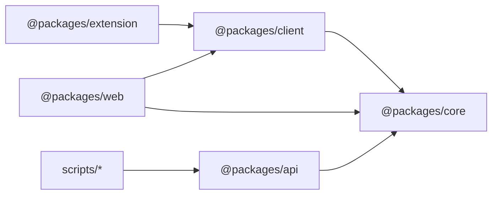
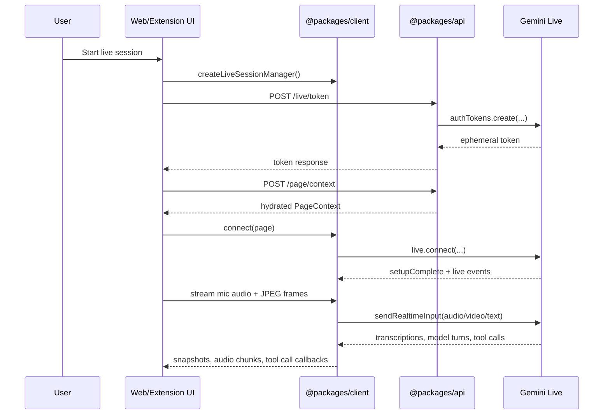
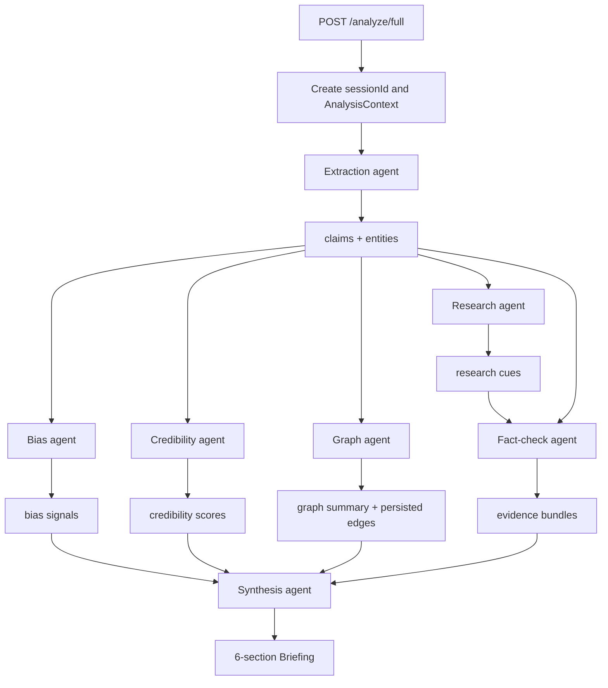
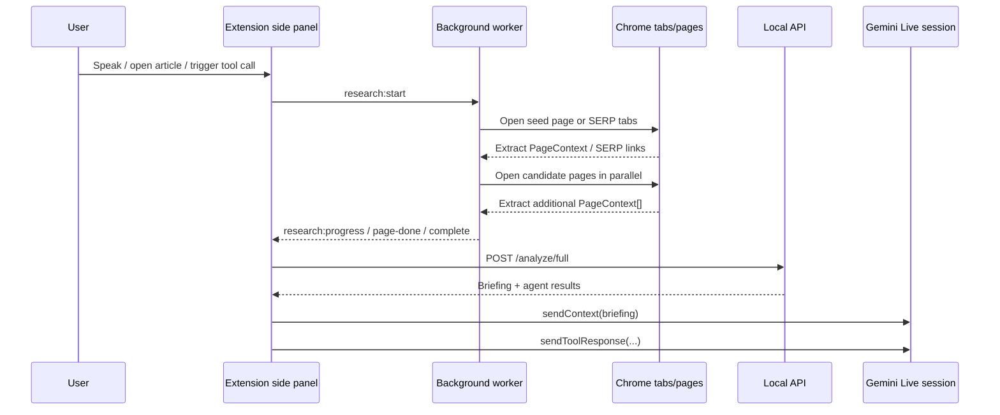

# Verity Architecture

Verity is a Bun workspace centred on a voice-first Gemini Live experience. The current implementation is package-based under `packages/*`; older references to a top-level `src/` architecture are historical and should not be treated as authoritative.

This document reflects the current codebase as implemented in:

- `packages/web` for the standalone browser demo
- `packages/client` for the shared live session runtime and reusable React UI
- `packages/api` for token brokering, page hydration, deterministic analysis, and orchestrated multi-agent analysis
- `packages/core` for shared contracts, defaults, prompts, and utilities
- `packages/extension` for the Chrome side panel and autonomous research workflow

## Repository shape

| Path | Purpose |
| --- | --- |
| `package.json` | Bun workspace root, shared scripts, dev/build entrypoints |
| `packages/core/index.ts` | Shared types, Gemini Live defaults, prompt builders, analysis helpers, orchestration contracts |
| `packages/api/src/index.ts` | Hono API server, HTTP routes, CORS, Gemini token minting, page hydration |
| `packages/api/src/orchestrator.ts` | Full extraction -> parallel analysis -> fact-check -> synthesis pipeline |
| `packages/api/src/agents/*` | Gemini-backed extraction, bias, credibility, research, fact-check, graph, and synthesis agents |
| `packages/api/src/graph/store.ts` | SQLite-backed session graph persistence |
| `packages/client/src/live-session.ts` | Gemini Live connection manager and inbound message loop |
| `packages/client/src/LiveVoiceSession.tsx` | Shared React UI for voice sessions |
| `packages/web/src/app/page.tsx` | Next.js browser demo that starts a live voice + screen-share session |
| `packages/extension/src/App.tsx` | Chrome side panel host for `LiveVoiceSession` plus research orchestration |
| `packages/extension/src/background.ts` | Extension service worker that runs autonomous research jobs |
| `packages/extension/src/research/*` | Query derivation, SERP parsing, page extraction, and tab-driven research orchestration |
| `scripts/*` | Dev scripts, workspace launchers, port cleanup, trafilatura installation, Python extraction bridge |

## Workspace dependencies



## Runtime overview

Verity currently exposes two user-facing entrypoints:

- The web demo in `packages/web`, which starts a Gemini Live session from a Next.js page.
- The Chrome extension in `packages/extension`, which embeds the shared live UI in a side panel and adds autonomous research on top.

Both entrypoints rely on the same shared live runtime in `packages/client`, the same shared contracts in `packages/core`, and the same local API in `packages/api`.

## Package responsibilities

### `@packages/core`

`packages/core/index.ts` is the cross-boundary contract layer. It defines:

- Live session defaults such as:
  - `GEMINI_LIVE_MODEL = "gemini-3.1-flash-live-preview"`
  - `GEMINI_LIVE_API_VERSION = "v1alpha"`
  - `GEMINI_LIVE_VOICE = "Erinome"`
  - `GEMINI_LIVE_SPEECH_LANGUAGE_CODE = "en-GB"`
- Shared HTTP request/response types for `/live/*`, `/page/context`, `/analyze`, and `/analyze/full`
- Shared analysis pipeline types:
  - `Claim`
  - `Entity`
  - `BiasSignal`
  - `CredibilityScore`
  - `EvidenceBundle`
  - `AnalysisContext`
  - `Briefing`
  - `AgentResult`
  - `OrchestrationRequest`
  - `OrchestrationResponse`
- Prompt and tool declaration helpers for Gemini Live:
  - `buildLiveSystemInstruction()`
  - `createResearchToolDeclarations()`
  - `createPageContextFunctionDeclaration()`
- The small deterministic local analysis path used by the legacy `/analyze` route
- `AsyncQueue`, which is reused by the live session manager as the inbound concurrency boundary

### `@packages/client`

`packages/client` is the shared browser-side runtime. It owns:

- The Gemini Live transport and message loop in `src/live-session.ts`
- Media capture and streaming helpers in:
  - `src/live-media.ts`
  - `src/screen-share.ts`
  - `src/microphone-stream.ts`
- The reusable React session shell in `src/LiveVoiceSession.tsx`

The design intent in the current codebase is clear: transport details stay in `live-session.ts`, while UI components orchestrate the session rather than reimplementing protocol logic.

### `@packages/api`

`packages/api` is a local Hono service that provides:

- Health and live config introspection
- Ephemeral Gemini Live token minting
- Page hydration from URL hints or screenshots
- A deterministic local analysis route
- Agent-specific routes for extraction, analysis, and synthesis
- The full orchestrated analysis route used by the extension

It also owns the server-side knowledge-graph persistence layer under `packages/api/src/graph`.

### `@packages/web`

`packages/web` is a Next.js 16 App Router demo. It:

- Fetches `/live/config`
- Requests screen-share and microphone capture
- Hydrates the current page via `/page/context`
- Connects to Gemini Live through `@packages/client`
- Streams live audio and JPEG screen frames into the session

### `@packages/extension`

`packages/extension` is a Chrome Manifest V3 side-panel app. It:

- Hosts the shared `LiveVoiceSession`
- Tracks the active tab to seed page hints
- Handles Gemini function calls for research
- Auto-triggers research from voice turns and page changes
- Runs background research in the service worker
- Calls `POST /analyze/full` and injects the resulting briefing back into Gemini Live

Its `manifest.json` currently requests:

- `sidePanel`
- `storage`
- `tabs`
- `scripting`
- `activeTab`
- `search`
- `alarms`
- `tabGroups`
- `host_permissions` including the local API and `<all_urls>`

## Browser live-session flow

The common live-session path runs through `packages/client/src/live-session.ts`.

Key characteristics in the current implementation:

- Browser clients authenticate through `POST /live/token`
- Gemini Live connects with:
  - audio response modality
  - Google Search grounding enabled at connect time
  - custom function declarations enabled at connect time
  - English (GB) speech config and the `Erinome` voice
  - context window compression
  - session resumption when a handle exists
- Runtime turns are sent via `sendRealtimeInput()`
- Injected context is sent via `sendClientContent()`
- Incoming server messages are serialized through `AsyncQueue`

### Live session sequence



### Live session manager details

`packages/client/src/live-session.ts` currently provides:

- `connect(page)`
- `sendText(text)`
- `sendContext(text)`
- `sendToolResponse(id, name, response)`
- `sendAudioChunk(base64Pcm16)`
- `sendAudioStreamEnd()`
- `sendVideoFrame(base64Jpeg)`
- `close()`

It maintains:

- session state
- partial user transcript
- partial assistant transcript
- last error
- turn-complete count
- optional session resumption handle

The inbound message loop handles:

- user transcription updates
- model transcription updates
- audio output chunks
- turn completion
- interruptions
- tool calls
- `goAway` notices for impending reconnect

## Web demo flow

`packages/web/src/app/page.tsx` is a thin host around the shared runtime.

Its flow is:

1. Fetch `/live/config`
2. Request screen-share and microphone access
3. Capture one initial screenshot
4. Call `POST /page/context`
5. Connect Gemini Live with the hydrated page
6. Start streaming screen frames and microphone audio
7. Render incremental transcripts and assistant audio playback

Unlike the extension, the web demo does not implement the autonomous research workflow or Gemini tool-call handling on top of the shared client.

## API surface

`packages/api/src/index.ts` exposes the following routes:

| Method | Path | Purpose |
| --- | --- | --- |
| `GET` | `/health` | Liveness probe |
| `GET` | `/fixtures` | Deterministic local analysis fixtures |
| `GET` | `/live/config` | Shared live-session config summary |
| `POST` | `/live/token` | Mint ephemeral Gemini Live token |
| `POST` | `/page/context` | Resolve/hydrate current page content |
| `GET` | `/validate` | Run deterministic fixture assertions |
| `POST` | `/analyze` | Legacy deterministic local analysis |
| `POST` | `/analyze/extract` | Extraction agent only |
| `POST` | `/analyze/bias` | Combined bias + credibility envelope |
| `POST` | `/analyze/synthesize` | Synthesis agent only |
| `POST` | `/analyze/full` | Full orchestrated multi-agent analysis |

### API runtime notes

The server currently:

- uses `hono` plus `@hono/node-server`
- permits CORS for configured local web origins plus `chrome-extension://*`
- exits early if `WEB_PORT` and `API_PORT` collide
- requires `GEMINI_API_KEY` for all Gemini-backed routes

## Page hydration flow

`POST /page/context` supports two resolution paths:

- `source = "hint"` when the caller already knows the URL
- `source = "screen"` when the API must infer the page URL from a shared screenshot

Implementation details:

- URL inference from screenshots uses `gemini-2.5-flash`
- article extraction uses the Python bridge in `scripts/trafilatura_extract.py`
- Python binary discovery falls back across platform-specific candidates
- the endpoint returns a normalized `PageContext`

```mermaid
flowchart TD
  A[POST /page/context] --> B{hintedUrl present?}
  B -->|yes| C[Normalize hinted URL/title]
  B -->|no| D{Screenshot provided?}
  D -->|no| E[400 error]
  D -->|yes| F[Resolve URL/title from screenshot via Gemini]
  F --> G{Resolved valid http(s) URL?}
  G -->|no| H[422 error]
  G -->|yes| I[Run trafilatura_extract.py]
  C --> I
  I --> J{Readable page text returned?}
  J -->|no| K[502/500 error]
  J -->|yes| L[Build normalized PageContext]
  L --> M[Return hydrated page]
```

## Orchestrated analysis pipeline

The current full server pipeline lives in `packages/api/src/orchestrator.ts`.

It builds a fresh `sessionId`, creates an `AnalysisContext`, and runs:

1. Extraction
2. Parallel research, bias, credibility, and graph stages
3. Fact-checking
4. Synthesis

Every stage is wrapped in a 30-second timeout via `withTimeout()`. The orchestrator collects per-agent `AgentResult` envelopes and returns either:

- `ok: true` with `briefing`, `context`, and `agents`
- `ok: false` with `partialContext` and `agents`

### Full pipeline diagram



### Shared orchestration context

The shared `AnalysisContext` currently contains:

- `sessionId`
- `pages`
- `claims`
- `entities`
- `biasSignals`
- `evidenceBundles`
- `credibilityScores`
- `language`
- `graphSummary`

The orchestrator merges agent outputs into that structure as they complete.

## Agent implementations

All current server agents use `@google/genai` with structured JSON output.

### Extraction agent

File: `packages/api/src/agents/extraction.ts`

- Model: `gemini-2.5-flash`
- Input: up to 3000 characters per page from the supplied `PageContext[]`
- Output:
  - `Claim[]`
  - `Entity[]`

### Bias agent

File: `packages/api/src/agents/bias.ts`

- Model: `gemini-2.5-flash`
- Input: pages, claims, entities
- Output: `BiasSignal[]`
- Focus: political lean, emotional language, framing technique, omission, source selection

### Credibility agent

File: `packages/api/src/agents/credibility.ts`

- Model: `gemini-2.5-flash`
- Input: pages, claims, entities
- Output: `CredibilityScore[]`
- Output style: heuristic page credibility scores with rationale and caveats

### Combined analysis agent

File: `packages/api/src/agents/analysis.ts`

- Runs bias and credibility in parallel
- Exists mainly for `POST /analyze/bias`
- Returns one combined envelope rather than a new analysis stage in the full orchestrator

### Research agent

File: `packages/api/src/agents/research.ts`

- Model: `gemini-2.5-flash`
- Uses Gemini's built-in Google Search tool server-side
- Input: pages, claims, user prompt
- Output: per-claim `ResearchCue[]`
- Role: provide independent verification/context cues, not full page ingestion

### Fact-check agent

File: `packages/api/src/agents/fact-check.ts`

- Model: `gemini-2.5-flash`
- Input: `Claim[]` and server research cues
- Output: `EvidenceBundle[]`
- Role: map each claim into supports / contradicts / unresolved buckets

### Graph agent

File: `packages/api/src/agents/graph-agent.ts`

- Model: `gemini-2.5-flash`
- Input: claims and entities
- Output: proposed relationship edges and a text summary
- Side effect: persists graph entities and edges in SQLite via `packages/api/src/graph/store.ts`

Allowed edge types are currently:

- `ownership`
- `influence`
- `contradiction`
- `collaboration`
- `affiliation`
- `other`

### Synthesis agent

File: `packages/api/src/agents/synthesis.ts`

- Model: `gemini-2.5-flash`
- Input: complete `AnalysisContext` plus `userPrompt`
- Output: a six-section `Briefing`

The required sections are:

- `summary`
- `framingAndBias`
- `evidenceAndCredibility`
- `entitiesAndRelationships`
- `missingContextAndOpposing`
- `whatToReadNext`

## Graph persistence

The graph store is implemented in `packages/api/src/graph/store.ts` using `bun:sqlite`.

Database path:

- default: `data/verity-graph.sqlite`
- override: `VERITY_GRAPH_DB`

Tables created on demand:

- `graph_entities`
- `graph_edges`

Current behaviour:

- entities are upserted by `type:name`
- edges are inserted per session
- summaries can be generated from persisted session edges

This is a lightweight persistence layer. It supports session summaries today, not a full end-user graph product.

## Extension architecture

The extension adds a second, separate research system on top of Gemini Live.

There are two distinct research paths in the current product:

- Server-side claim research inside `POST /analyze/full`
- Client-side autonomous tab research inside the extension

### Extension flow

`packages/extension/src/App.tsx` does all of the following:

- seeds the current tab URL/title into `LiveVoiceSession`
- enforces capture permissions
- listens for user-turn completion
- intercepts Gemini function calls
- auto-triggers research when spoken intent looks analytical
- proactively researches article-like pages on tab changes
- injects research results back into the live session

The service worker in `packages/extension/src/background.ts` receives `research:start` and `research:cancel` messages and delegates execution to `packages/extension/src/research/orchestrator.ts`.

### Extension research sequence



### Extension autonomous research mechanics

`packages/extension/src/research/orchestrator.ts` currently supports three inputs:

- `{ source: "page", tabId }`
- `{ source: "query", query }`
- `{ source: "urls", urls }`

Current configuration in `research/types.ts`:

- max concurrent tabs: `5`
- per-tab timeout: `15_000ms`
- total research timeout: `60_000ms`
- max pages read: `15`
- max SERP results: `8`

The research loop currently:

1. Reads the seed page or URLs
2. Derives search queries from the seed content
3. Opens Google SERPs in background tabs
4. Extracts result links from those SERPs
5. Filters URLs for relevance/authority
6. Reads selected pages in parallel
7. Retains the most relevant `PageContext[]`
8. Emits `research:complete`

### Injection back into Gemini Live

When extension research completes, `packages/extension/src/App.tsx`:

1. snapshots Gemini's immediate grounding-only answer
2. calls `POST /analyze/full` with the collected contexts
3. if successful, formats the returned `Briefing` into injected session context
4. if that fails, falls back to injecting raw source snippets
5. sends a matching tool response so Gemini does not hang waiting for function completion

This means the extension is effectively layering a deeper research-and-synthesis pass on top of the normal Gemini Live conversation.

## Deterministic analysis path

The repository still contains a smaller deterministic local analysis path in `packages/core/index.ts` and the `/analyze` route.

That path:

- does not call Gemini
- inspects page text heuristically
- produces:
  - summary
  - bias signals
  - missing context
  - confidence notes
  - follow-up prompts
  - one grounded quote

It remains useful for validation fixtures and local guardrails, but it is not the main product path.

## Environment and runtime expectations

The current codebase expects a root `.env` with values such as:

- `GEMINI_API_KEY`
- `WEB_PORT`
- `API_PORT`
- `WEB_ORIGIN`
- `NEXT_PUBLIC_API_ORIGIN`
- optional `PYTHON_BIN`
- optional `VERITY_GRAPH_DB`

Important runtime constraints:

- `GEMINI_API_KEY` is server-side only
- browser clients rely on ephemeral tokens from `/live/token`
- `WEB_PORT` and `API_PORT` must differ
- page hydration depends on Python plus `trafilatura`
- the extension calls the API with `chrome-extension://...` origins, which the API explicitly allows

## Dev and build entrypoints

Root scripts currently provide:

- `bun run dev`
- `bun run dev:web`
- `bun run dev:api`
- `bun run dev:ext`
- `bun run build`
- `bun run build:web`
- `bun run build:ext`
- `bun run check-types`
- `bun run lint`
- `bun run setup:trafilatura`

## Current implementation boundaries

What is clearly implemented today:

- shared Gemini Live browser runtime
- ephemeral token brokerage
- page hydration from URL hints or screenshots
- a real multi-agent analysis pipeline in the API
- server-side graph persistence
- a web demo
- an extension side panel
- autonomous extension research with reinjection into the live session

What is not yet a full product layer in the current code:

- end-user graph exploration UI
- streaming partial orchestrator output
- explicit multilingual orchestration beyond a default `language: "en"` field
- richer ingest types like PDFs or transcript-native media pipelines
- a persistent dashboard or user-personalization product surface

## Practical reading order

For the quickest accurate understanding of the current system, read files in this order:

1. `packages/core/index.ts`
2. `packages/client/src/live-session.ts`
3. `packages/client/src/LiveVoiceSession.tsx`
4. `packages/api/src/index.ts`
5. `packages/api/src/orchestrator.ts`
6. `packages/api/src/agents/*`
7. `packages/web/src/app/page.tsx`
8. `packages/extension/src/App.tsx`
9. `packages/extension/src/background.ts`
10. `packages/extension/src/research/orchestrator.ts`
