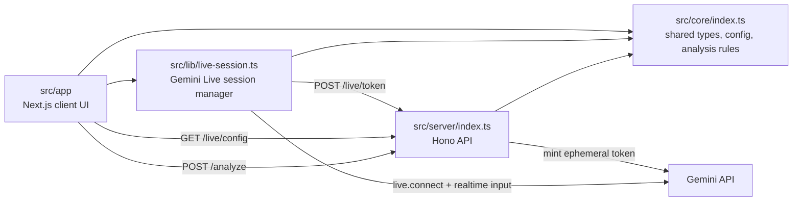
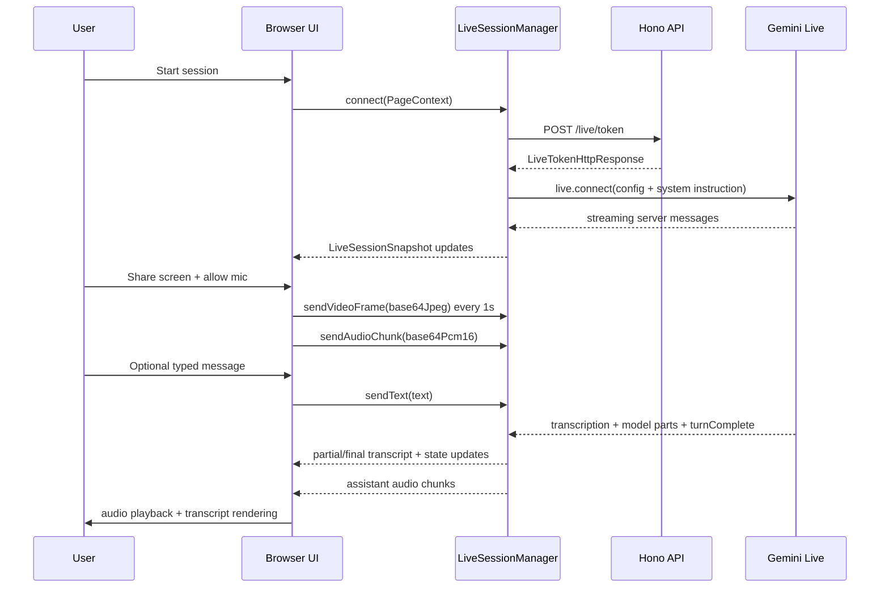
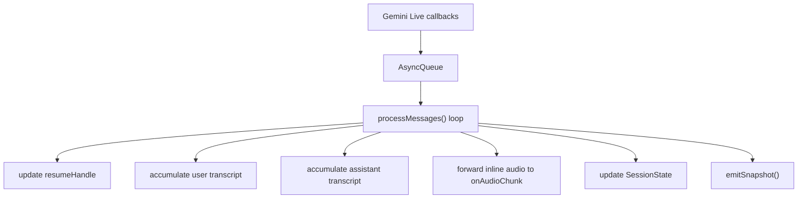
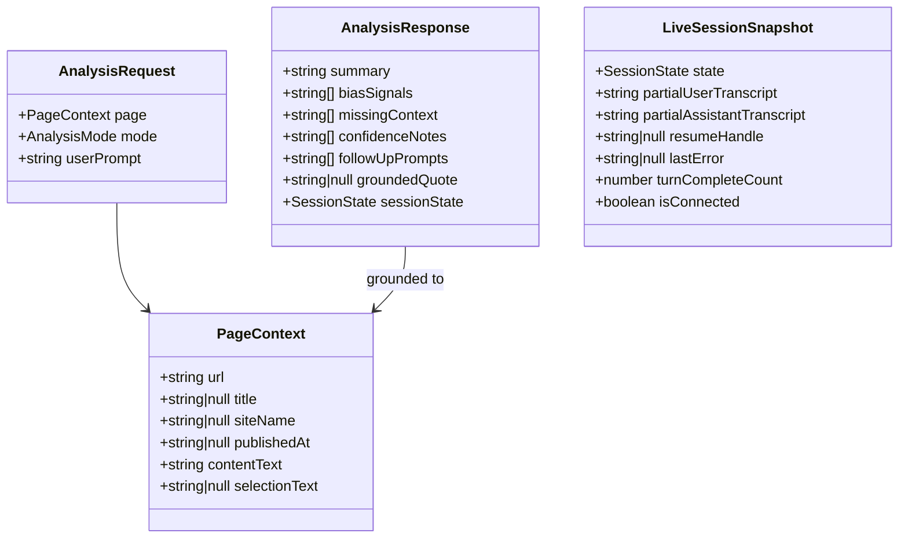
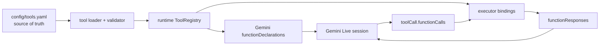
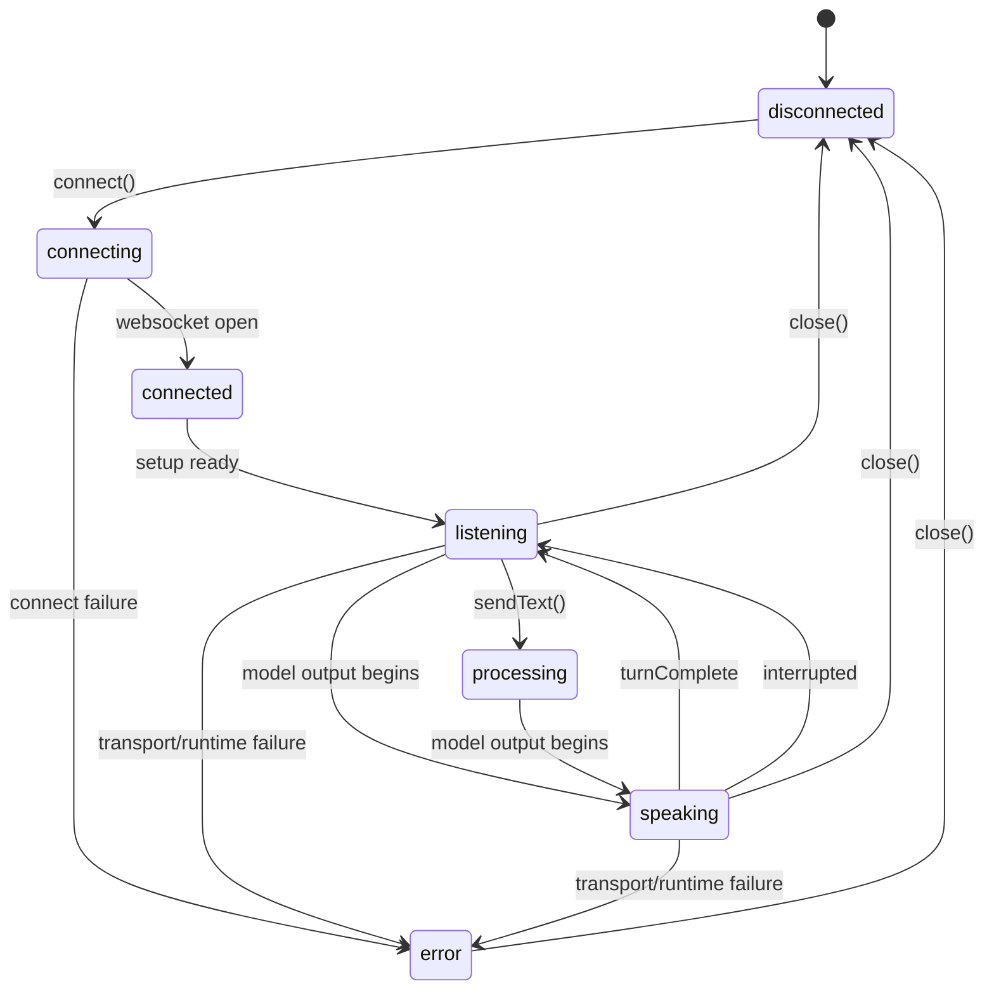

# Verity Architecture

> **Deprecated layout.** The live codebase is a **Bun workspace** under `packages/*` (`packages/web`, `packages/api`, `packages/client`, `packages/core`, `packages/extension`). This file describes an older **top-level `src/`** layout that is no longer authoritative.
>
> **Current architecture and implementation status (done vs remaining):** see [`docs/architecture.md`](docs/architecture.md) and [`docs/PDR.md`](docs/PDR.md) section 13. For navigation, prefer root [`AGENTS.md`](AGENTS.md).

---

## Purpose

Verity is currently a TypeScript-only Phase 1 "voice analyst" slice. The system combines:

- a Next.js browser client in `src/app`
- a browser-side Gemini Live session manager in `src/lib`
- a Hono API server in `src/server`
- a shared domain and policy layer in `src/core`

The durable architectural goal is a realtime loop where the browser streams voice and screen context into a Gemini Live session, while the server brokers credentials and the shared core preserves product semantics, contracts, and analysis rules.

## Durable Decisions

These decisions appear intentional and should be treated as architectural constraints until explicitly changed.

1. TypeScript-only runtime
Verity's executable path is entirely TypeScript. `src/core`, `src/lib`, `src/server`, and `src/app` are the stable units of composition.

2. Shared domain model in `src/core`
All cross-boundary types and stable runtime constants live in `src/core/index.ts`. Browser and server both import from this module instead of redefining payloads.

3. Live interaction is browser-owned
The browser owns microphone capture, screen-share capture, transcript rendering, audio playback, and Gemini Live websocket session lifecycle through `createLiveSessionManager()`.

4. Credential minting is server-owned
Long-lived Gemini credentials stay on the server. The browser requests short-lived ephemeral tokens from `POST /live/token`.

5. Queue-driven live message processing
Inbound Gemini Live events are serialized through `AsyncQueue<LiveServerMessage>` in `src/lib/live-session.ts`. This is the core concurrency contract for the realtime session loop.

6. Runtime input uses `sendRealtimeInput`
Typed text, PCM audio, and JPEG video frames are all sent as runtime input through `sendRealtimeInput(...)`. The architecture is aligned to Gemini Live 3.1 conventions.

7. Deterministic local analysis remains available
`src/server/index.ts` exposes `/analyze`, `/fixtures`, and `/validate` backed by `analyzePage()` in `src/core`. This gives the codebase a non-live validation path for product behavior and guardrails.

8. Epistemic behavior is code, not prompt-only
Calibrated uncertainty, omission analysis, and false-balance avoidance are encoded in deterministic analysis logic and in the live system instruction builder.

9. Phase 1 excludes persistence and orchestration
There is no durable storage, job system, knowledge graph, or research fan-out in the critical path. The current design intentionally keeps those concerns outside `src`.

## Source Map



## Module Responsibilities

### `src/core`

`src/core/index.ts` is the system's stable contract layer.

- Defines canonical types:
  - `PageContext`
  - `AnalysisRequest`
  - `AnalysisResponse`
  - `SessionState`
  - `LiveConfigSummary`
  - HTTP response contracts for health, live config, and token minting
- Defines runtime constants:
  - `API_DEFAULT_PORT`
  - `GEMINI_LIVE_MODEL`
  - `GEMINI_LIVE_API_VERSION`
  - `GEMINI_LIVE_VOICE`
- Encodes product policy:
  - `buildLiveSystemInstruction(page)`
  - `analyzePage(request)`
  - `createFixtureRequests()`
  - `runFixtureAssertions()`
- Supplies low-level shared utilities:
  - `AsyncQueue<T>`
  - `accumulateTranscript(...)`
  - whitespace normalization and site-name inference

Durable rule: if a payload crosses module boundaries, it should be represented here first.

### `src/lib`

`src/lib/live-session.ts` owns the browser-side live runtime.

- Connects to Gemini Live with an ephemeral token
- Builds the session config from shared core defaults
- Maintains explicit session state and transcript accumulators
- Serializes incoming `LiveServerMessage` events through `AsyncQueue`
- Emits a coarse-grained `LiveSessionSnapshot` to the UI
- Sends runtime input over four channels:
  - text
  - PCM16 audio at 16 kHz
  - JPEG video frames
  - audio stream termination

Durable rule: websocket callback handling is not spread across the UI; it is centralized here.

### `src/app`

`src/app/page.tsx` is the composition root for the browser experience.

- Fetches `/live/config` on load
- Creates and tears down the `LiveSessionManager`
- Captures screen-share frames at 1 FPS
- Captures microphone audio, downsamples it to PCM16/16kHz, and streams it
- Plays assistant audio at 24 kHz
- Renders transcript history and live partial transcripts
- Builds the session's initial `PageContext`

Durable rule: the UI is a thin orchestration surface over the live session manager rather than a second protocol implementation.

### `src/server`

`src/server/index.ts` is a narrow HTTP boundary.

- Exposes health and validation endpoints
- Publishes live client configuration
- Mints ephemeral Gemini tokens from the server-side API key
- Normalizes analysis requests and returns deterministic analysis results
- Enforces a basic environment invariant: `WEB_PORT` and `API_PORT` must differ

Durable rule: server concerns are HTTP contracts and credential brokerage, not browser session state.

## Runtime Flows

### Realtime Session Flow



### Internal Message Handling



The queue is the main durability point in the design. It prevents websocket callback races from leaking directly into UI state mutation.

## Contracts

### Core Domain Types



### HTTP API Contracts

The current HTTP surface is intentionally small.

| Method | Path | Request | Response | Purpose |
|---|---|---|---|---|
| `GET` | `/health` | none | `HealthResponse` | Service liveness and workspace identity |
| `GET` | `/fixtures` | none | `{ ok, fixtures }` | Returns deterministic fixture requests |
| `GET` | `/live/config` | none | `LiveConfigHttpResponse` | Publishes client-visible live configuration |
| `POST` | `/live/token` | none | `LiveTokenHttpResponse` | Mints a single-use ephemeral token |
| `GET` | `/validate` | none | `{ ok, results }` | Runs fixture assertions |
| `POST` | `/analyze` | partial `AnalysisRequest` | `AnalyzeHttpResponse` | Deterministic page analysis |

Durable rule: browser-facing contracts are typed in `src/core` and implemented in `src/server`.

### Live Session Manager Contract

`createLiveSessionManager(options)` returns an object with the following stable surface:

- `connect(page: PageContext): Promise<void>`
- `sendText(text: string): void`
- `sendAudioChunk(base64Pcm16: string): void`
- `sendAudioStreamEnd(): void`
- `sendVideoFrame(base64Jpeg: string): void`
- `close(): void`
- `getSnapshot(): LiveSessionSnapshot`

This is the main abstraction boundary between `src/app` and Gemini Live.

### Tool Calling Framework

Tool calling is not implemented in the current runtime, but the project needs one accepted contract before tools are introduced. The durable framework for this codebase is:

1. YAML registry as the source of truth
All model-exposed tool declarations should be defined in one versioned YAML registry, recommended at `config/tools.yaml`.

2. Runtime registry in code
Application code should load the YAML definitions, validate them, and bind each declared tool name to one executor implementation.

3. Connect-time Gemini exposure
Only the subset of enabled tools intended for the active session may be translated into Gemini `functionDeclarations`, because Gemini Live requires tools to be declared at `live.connect(...)` time.

4. Strict split between live tools and orchestration tools
Fast, synchronous tools may run directly in a live turn. Slow, parallel, or durable work must be exposed through orchestration tools such as `start_job` and `get_job_status`.

5. Tool calls are data contracts, not prompt prose
The model should only see tool metadata and JSON-schema-like parameter contracts derived from the YAML registry, never ad hoc executor details.

6. Executor ownership follows trust boundaries
Browser tools may only perform local UI or capture-safe actions. Server and orchestrator tools own credentials, network access, durable state, and side effects.

#### Accepted Tool Architecture



#### Registry Contract

The accepted registry shape is:

```yaml
version: 1
tools:
  - name: get_current_page_context
    description: Return the current normalized page context for the active session.
    enabled: true
    exposure: live
    executor: browser
    mode: sync
    side_effects: read
    timeout_ms: 1500
    parameters:
      type: object
      properties: {}
      required: []
    returns:
      type: object
      properties:
        page:
          $ref: "#/schemas/PageContext"
      required: [page]

  - name: start_job
    description: Start a long-running research or verification job.
    enabled: true
    exposure: live
    executor: server
    mode: async_job
    side_effects: write
    timeout_ms: 3000
    parameters:
      type: object
      properties:
        kind:
          type: string
        prompt:
          type: string
      required: [kind, prompt]
    returns:
      type: object
      properties:
        jobId:
          type: string
        status:
          type: string
      required: [jobId, status]
```

Each tool entry must define at least:

- `name`: globally unique identifier used in Gemini and executor lookup
- `description`: model-facing description
- `enabled`: whether the tool may be exposed at runtime
- `exposure`: `live` or `internal`
- `executor`: `browser`, `server`, or `orchestrator`
- `mode`: `sync` or `async_job`
- `side_effects`: `read` or `write`
- `timeout_ms`: max allowed runtime for one invocation
- `parameters`: object schema for arguments
- `returns`: object schema for success payloads

Optional registry-level `schemas` may hold shared object definitions such as `PageContext`, `AnalysisRequest`, or `AnalysisResponse`.

#### Runtime Rules

- The YAML file is the only source of truth for model-visible tool declarations.
- Code may enrich declarations with local metadata, but must not change argument or return shapes after load.
- Every exposed tool name must have exactly one executor binding.
- Unknown tool names, duplicate names, or invalid schemas are startup-time errors.
- Only `enabled: true` tools may be exposed to Gemini.
- Session-specific exposure is allowed, but it must be a filtered subset of the YAML registry.
- Tool declarations sent to Gemini must be derived mechanically from the registry, not handwritten per session.
- Tool results must be returned with `sendToolResponse(...)`, not `sendClientContent(...)`.

#### Sync vs Async Contract

Synchronous live tools:

- are expected to complete within one live turn
- should be read-mostly or tightly bounded mutations
- should return structured data immediately

Asynchronous orchestration tools:

- are used for slow, parallel, or durable work
- should return a job handle quickly
- must be polled or resumed through a status tool such as `get_job_status`
- must not block the live turn on heavy backend research

Recommended baseline orchestration tools:

- `start_job`
- `get_job_status`
- `cancel_job`

#### Trust Boundary Rules

- Browser executors must not own long-lived credentials.
- Browser executors must not perform privileged network mutations directly.
- Server executors may use secrets and protected connectors.
- Orchestrator executors may coordinate fan-out, retries, durable job state, and synthesis work.
- Any write-capable tool must be explicitly marked with `side_effects: write`.

#### Relationship To Current Code

This framework is intentionally compatible with the existing architecture:

- `src/core` should own shared tool types and registry validation rules
- `src/lib/live-session.ts` should translate enabled live tools into Gemini declarations at connect time
- `src/server` should host privileged executors and orchestration endpoints
- `src/app` should only participate in browser-scoped executor bindings when the tool is safe to run client-side

This defines the accepted tool contract now without claiming the tool runtime already exists.

## Data Model

### Canonical Page Model

`PageContext` is the primary data object flowing through the system.

- `url` is required and is the identity anchor for the viewed page
- `title`, `siteName`, and `publishedAt` are optional metadata
- `contentText` is the main deterministic analysis substrate
- `selectionText` is optional focus context layered on top of the page body

Durable rule: both live and deterministic analysis are page-grounded.

### Analysis Model

`AnalysisRequest` combines:

- a normalized `PageContext`
- `mode`, currently one of `on_demand | analyst | sentinel`
- `userPrompt`

`AnalysisResponse` returns:

- one `summary`
- structured rationale arrays for bias, missing context, and confidence
- suggested follow-ups
- one `groundedQuote`
- a `sessionState` marker

Durable rule: analysis output is structured first and natural-language second.

### Session State Model

The explicit session-state enum is:

- `disconnected`
- `connecting`
- `connected`
- `listening`
- `processing`
- `speaking`
- `error`



Durable rule: operational state is explicit and transport-driven, not inferred from transcript text or button state.

## Boundary Rules

### Browser vs Server

Browser-owned:

- microphone permission and capture
- screen-share permission and capture
- local playback of assistant audio
- transcript presentation
- live Gemini session lifecycle

Server-owned:

- long-lived Gemini credential storage
- ephemeral token creation
- deterministic validation and analysis endpoints
- coarse HTTP configuration surface

### Core vs Application Logic

Core-owned:

- shared types
- stable constants
- deterministic product rules
- prompt/system-instruction composition helpers

Application-owned:

- DOM APIs
- React state
- media capture/playback
- HTTP wiring
- API process bootstrap

## Extension Path

The current code is already shaped for later expansion without rewriting the Phase 1 loop.

Likely future additions that fit the current architecture:

- tool declarations added at live session connect time
- server-side orchestration tools behind the existing API boundary
- persistent storage layered behind `src/server` without changing `PageContext`
- richer analysis engines reusing `AnalysisRequest` and `AnalysisResponse`

Likely breaking changes:

- moving live session ownership from browser to server
- replacing `PageContext` as the primary grounding object
- removing the queue-driven message processor
- embedding long-lived credentials in the browser

## Non-Goals In Current Architecture

The following are intentionally absent from `src` today:

- durable memory or knowledge graph storage
- multi-user session management
- async job orchestration
- background worker fleet
- research fan-out or retrieval pipelines
- production-grade observability and policy enforcement

Their absence is a feature of the current architecture, not a gap in the document.

## Files To Revisit When Architecture Changes

- [src/core/index.ts](</C:/Users/ruari/Storage/Code/verity/src/core/index.ts>)
- [src/lib/live-session.ts](</C:/Users/ruari/Storage/Code/verity/src/lib/live-session.ts>)
- [src/app/page.tsx](</C:/Users/ruari/Storage/Code/verity/src/app/page.tsx>)
- [src/server/index.ts](</C:/Users/ruari/Storage/Code/verity/src/server/index.ts>)

When a future change alters boundaries, data contracts, or ownership, update this document alongside those files.
