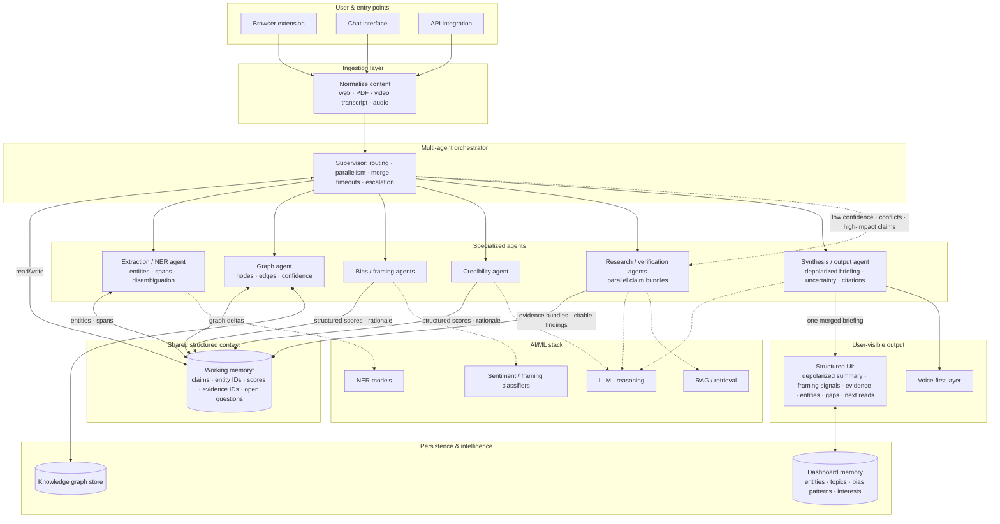

# Real-Time Multimodal Intelligence Agent — End-to-End Architecture

This diagram reflects the system described in [`PDR.md`](./PDR.md): entry points → ingestion → orchestrator → specialized agents → shared structured context → synthesis → user-facing output, with persistence and model dependencies. Synthesis defaults to a **depolarized, evidence-aware briefing** (see PDR §1.5), not a single authoritative “correct” answer.

## Legend

- **Solid arrows**: primary data and orchestration paths (ingest → fan-out → merge → synthesis).
- **Dotted arrows**: model/tool usage and orchestrator **escalation** to research agents when confidence is low, claims conflict, or impact is high.
- **Shared structured context**: agents coordinate through a common representation (claims, entities, scores, evidence) rather than separate ad-hoc streams to the user.
- **Epistemic stance**: merged output is framed as **analysis with limits**, not infallible truth (PDR §1.5).
