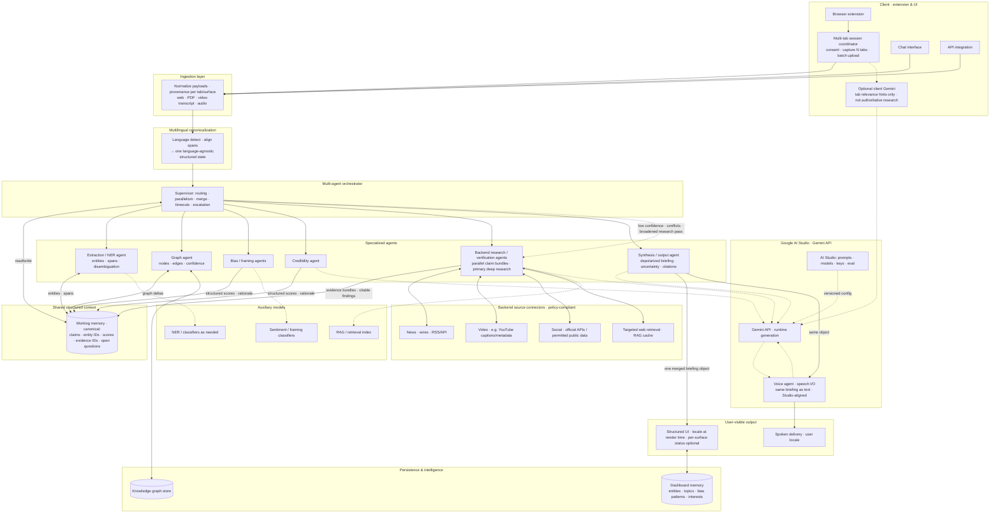

# Real-Time Multimodal Intelligence Agent — End-to-End Architecture

## Repository layout

| Package | Role |
| --- | --- |
| `packages/core` | Shared types, constants, and domain logic (single source of truth for cross-package contracts). |
| `packages/web` | Next.js App Router UI and any BFF/route handlers you add there. |
| `packages/api` | Standalone HTTP API (Hono); extends `core` for health and future REST/WS surfaces. |

Run **`bun run dev`** from the repo root to start `packages/web` and `packages/api` together. Ports, CORS (`WEB_ORIGIN`), and server-side API URL (`API_ORIGIN`) are defined in the **repo-root `.env`** (see `.env.example`).

---

This diagram reflects the system described in [`PDR.md`](./PDR.md): **multi-tab client capture** → ingestion → **multilingual canonicalization** → orchestrator → specialized agents → **backend research + source connectors** → shared structured context → **Gemini-backed** synthesis → user-facing output (text **and** voice from the **same** briefing). Synthesis defaults to a **depolarized, evidence-aware briefing** (PDR §1.5), not a single authoritative “correct” answer.

**API stack**: prompts and keys are managed in [Google AI Studio](https://aistudio.google.com/prompts/new_chat); production uses the **Gemini API** aligned with that configuration (PDR §1.6).

**Multi-tab & backend research** (PDR §1.7, §4.1, §4.11): the extension batches **several tabs** in one session; **research agents** on the backend add **news / video / social / web** evidence via **policy-compliant connectors**—detailed verification is **server-side**, not split across ad-hoc client-only models.

> **Note:** Mermaid node text is plain; the Studio URL is documented in this file’s intro and in PDR §1.6.

## Legend

- **Solid arrows**: primary data and orchestration paths (multi-tab **batch** ingest → **canonicalize** → fan-out → **backend research** → merge → synthesis).
- **Dotted arrows**: model/API usage (Gemini API, optional **client hints** only), auxiliary models, and orchestrator **escalation** to research agents.
- **Multi-tab (`MT`)**: several tabs → **one** batched ingest; all surfaces merge in **MEM** before synthesis (PDR §1.7).
- **Connectors**: **server-side** only; broaden evidence (news, video, social, web) under **ToS/API** rules—**not** a substitute for user judgment (PDR §4.11).
- **Client Gemini (`FE_G`)**: optional **UX hints** (e.g. tab relevance); **authoritative** research stays in **RES_POOL** + connectors.
- **Shared structured context**: one **language-agnostic** representation after `LANG` (PDR §1.6).
- **Gemini stack**: Studio = **development and configuration**; **GAPI** = **runtime**. **Voice agent** uses the **same** merged briefing as the UI.
- **Epistemic stance**: merged output is **analysis with limits**, not infallible truth (PDR §1.5).
