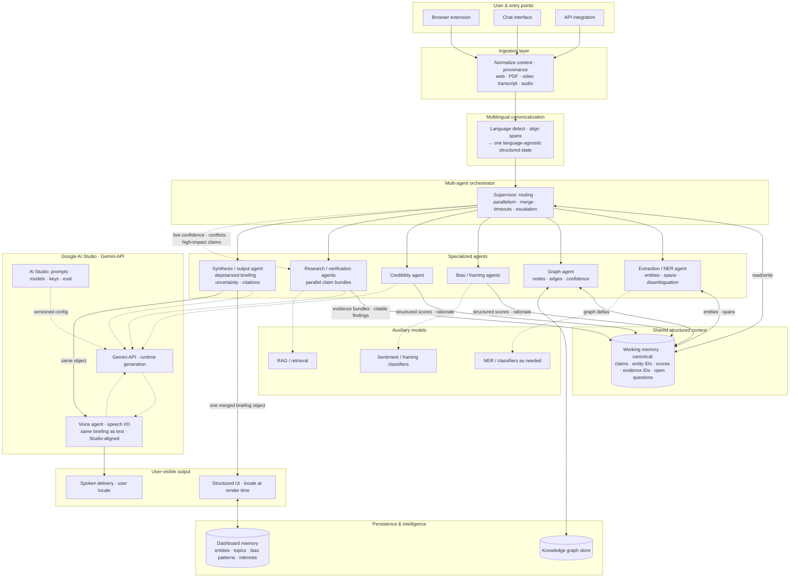

# Real-Time Multimodal Intelligence Agent — End-to-End Architecture

This diagram reflects the system described in [`PDR.md`](./PDR.md): entry points → ingestion → **multilingual canonicalization** → orchestrator → specialized agents → shared structured context → **Gemini-backed** synthesis → user-facing output (text **and** voice from the **same** briefing). Synthesis defaults to a **depolarized, evidence-aware briefing** (PDR §1.5), not a single authoritative “correct” answer.

**API stack**: prompts and keys are managed in [Google AI Studio](https://aistudio.google.com/prompts/new_chat); production uses the **Gemini API** aligned with that configuration (PDR §1.6).

> **Note:** Mermaid node text is plain; the Studio URL is also documented in this file’s intro and in PDR §1.6. In diagrams that do not support HTML links, refer to **Google AI Studio → Prompts (new chat)**.

## Legend

- **Solid arrows**: primary data and orchestration paths (ingest → **canonicalize** → fan-out → merge → synthesis).
- **Dotted arrows**: model/API usage (Gemini API, auxiliary models) and orchestrator **escalation** to research agents.
- **Shared structured context**: one **language-agnostic** representation after `LANG` so cross-language evidence merges before synthesis (PDR §1.6).
- **Gemini stack**: Studio is for **development and configuration**; **GAPI** is **runtime**. **Voice agent** uses the **same** merged briefing as the UI; locale is applied at **render / speak** time.
- **Epistemic stance**: merged output is framed as **analysis with limits**, not infallible truth (PDR §1.5).
